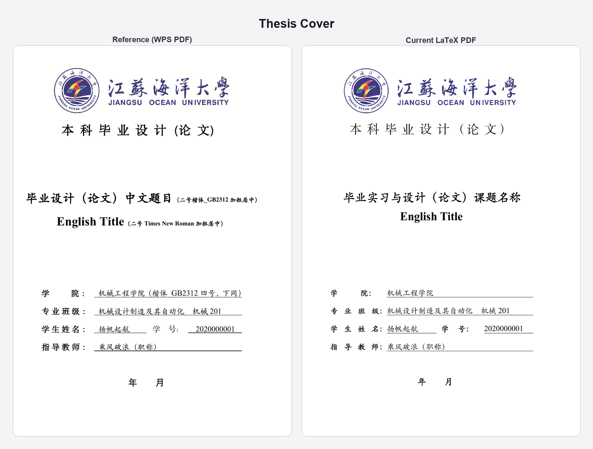
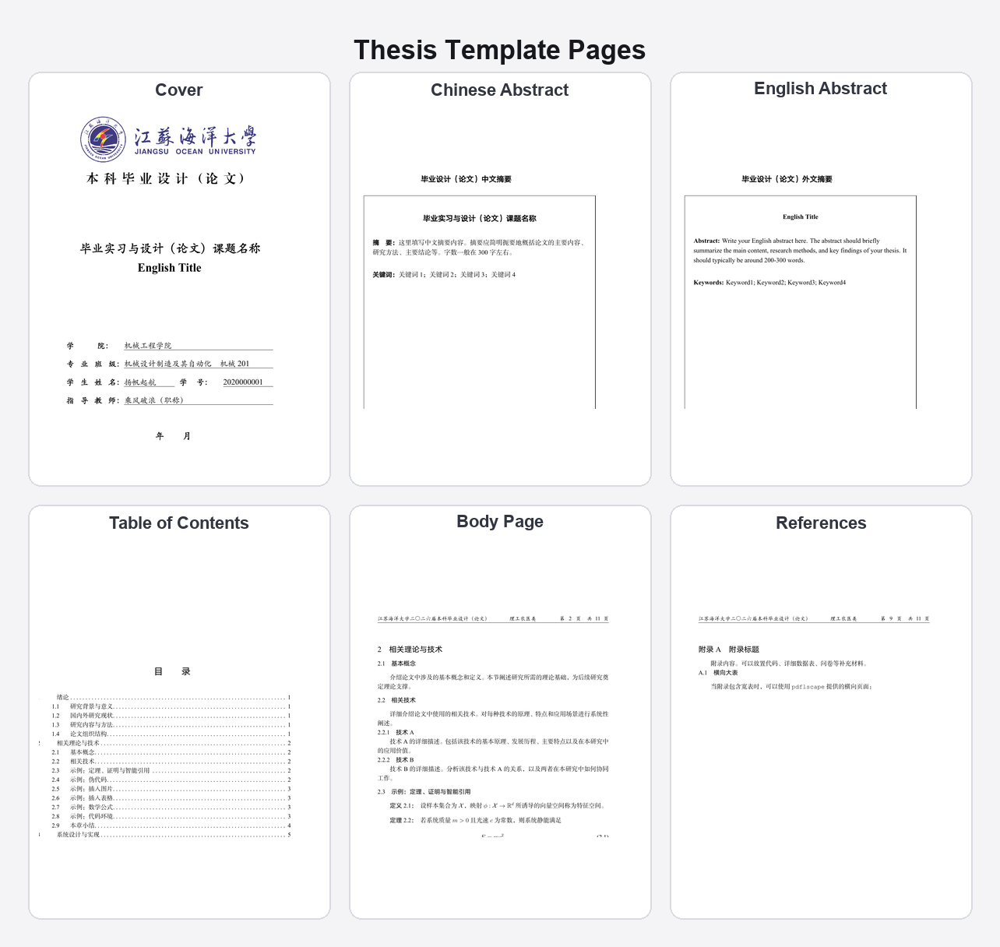
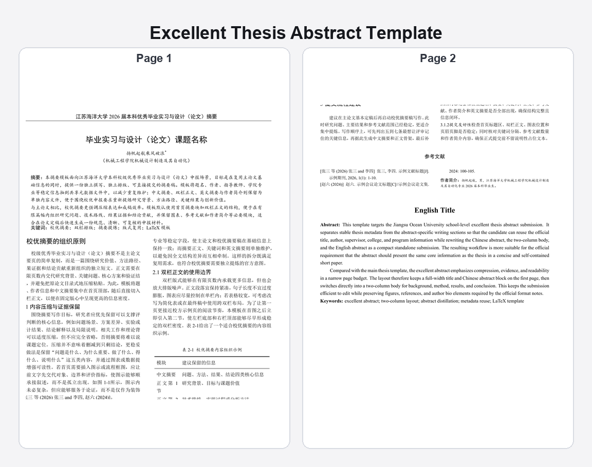
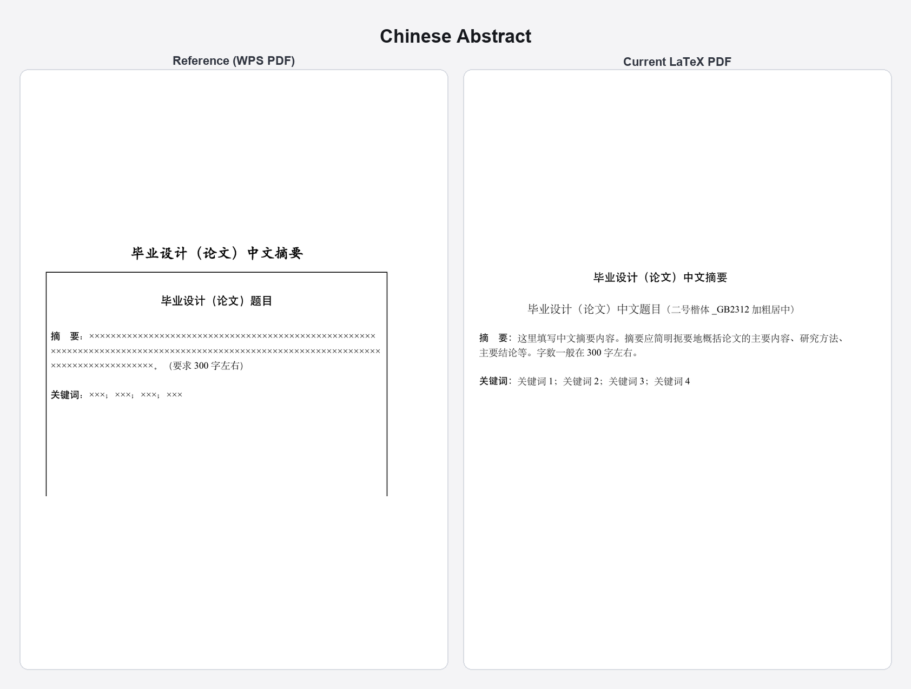
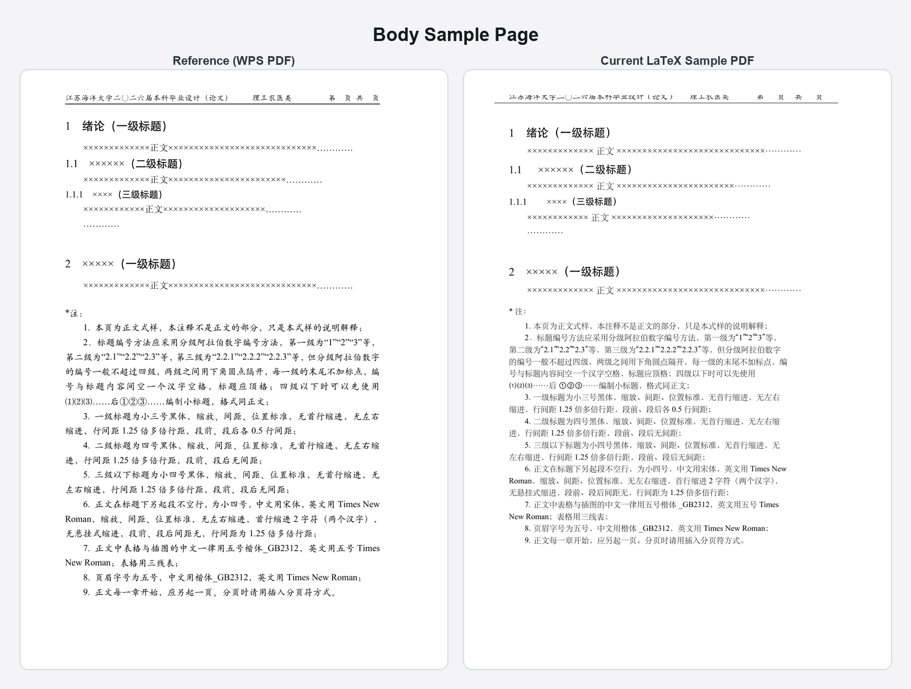
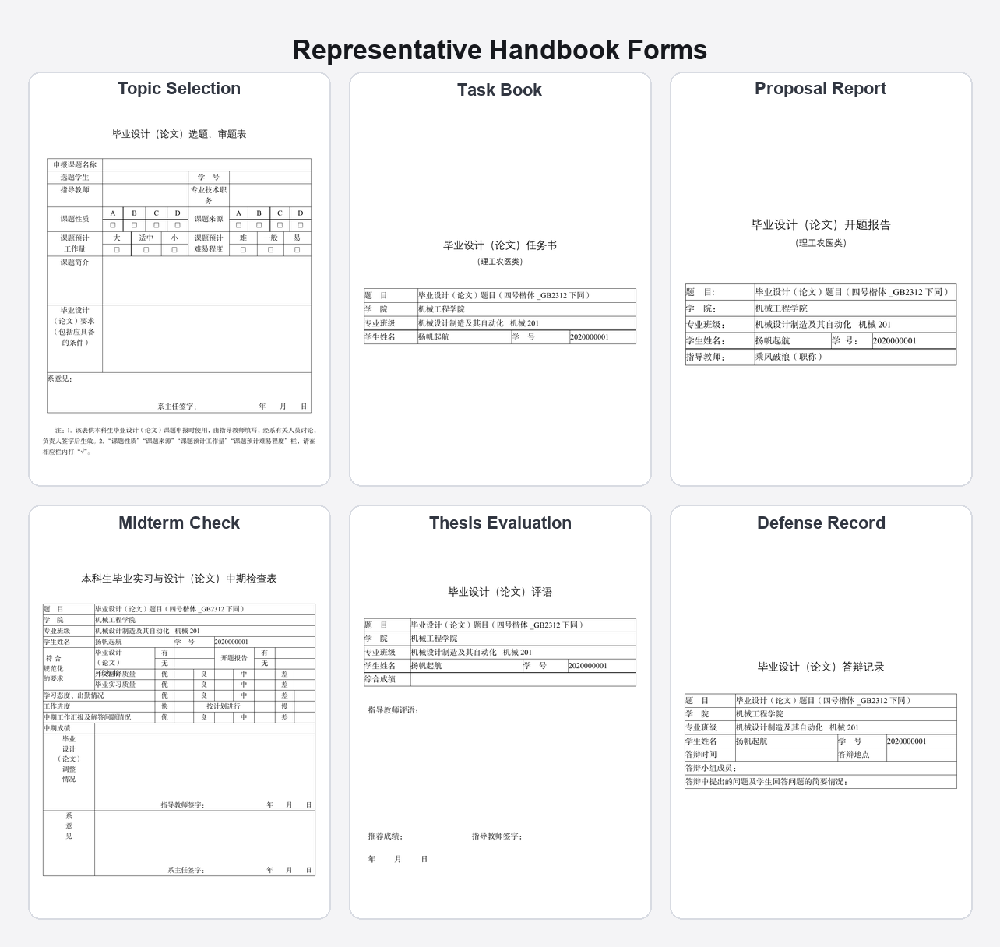

<div align="center">


# JOU Undergraduate Thesis LaTeX Template

**江苏海洋大学本科毕业论文 LaTeX 模板** | Jiangsu Ocean University Thesis Template

*Jiangsu Ocean University Undergraduate Thesis LaTeX Template* | *LaTeX Thesis Template for Chinese University*

[](https://www.latex-project.org/lppl.txt)
[](https://www.tug.org/texlive/)
[](#)

English | [简体中文](README.md)

</div>

---

## Overview

> 🔍 **Search keywords:** Jiangsu Ocean University thesis template, JOU LaTeX thesis, Chinese university thesis template, graduate thesis LaTeX template, academic paper template China

**Word is the submission format; LaTeX is the writing tool.** Although the university currently requires Word submissions, this project aims to promote a more standardized and modern approach to academic writing on campus.

This project provides a ready-to-use LaTeX thesis template based on the *Jiangsu Ocean University 2026 Graduation Internship and Thesis Work Manual*, suitable for local writing and use with AI-assisted tools.

The repository currently includes:

- 1 main thesis template `main.tex`
- 18 handbook companion templates
- 1 school-level excellent thesis abstract template
- 1 bundled open-source font set — compiles on Linux, macOS, and Windows without manual font installation

The template ships with bundled open-source fallback fonts, ready to compile out of the box. If standard fonts such as SimSun, SimHei, KaiTi_GB2312, or Times New Roman are already installed on your system, the template will automatically prefer them for formal submissions.

## Distribution Channels

- `GitHub repository`: the complete version with full font strategy, latest fixes, and issue tracking — use this as the canonical source.
- `Overleaf Gallery`: a lightweight preview edition with limited fonts and incomplete resources — not recommended for formal submissions.

**We recommend cloning the GitHub repository** for writing. Do not rely solely on the Overleaf Gallery version.

## Highlights

- `Academic standards first`: covers and body text prioritize KaiTi_GB2312 / SimSun / SimHei / Times New Roman for formal submission requirements.
- `Ready out of the box`: bundled open-source fallback fonts require no additional system font installation — clone and compile immediately.
- `Cross-platform consistency`: compiles correctly on Windows, macOS, and Linux with consistent output.
- `Complete template set`: in addition to the thesis body, includes 18 form/report/grading templates from the handbook.
- `Automatic font adaptation`: if standard fonts are installed locally, the template automatically prefers them; use the `strictfonts` option for final submission verification.
- `Layout aligned with handbook`: cover, abstract, table of contents, and body layout all follow the work manual specifications, continuously verified via CI.

## Preview

### Thesis cover: reference page vs current template



### Thesis template gallery

The image below shows the core thesis pages from the current template: cover, Chinese abstract, English abstract, table of contents, first body page, and references.



### Excellent thesis abstract template

This dedicated template follows the *Jiangsu Ocean University School-Level Excellent Graduation Internship and Thesis Abstract Format Guidelines*: page 1 retains the full-width blocks for title, author, supervisor, and Chinese abstract; the body and references switch to a two-column layout; and the English title and English abstract return to full-width at the end.



Rule-by-rule notes are documented in [docs/reports/excellent-thesis-abstract-compliance.md](docs/reports/excellent-thesis-abstract-compliance.md).

### Key layout details: abstract and body comparison

The following comparison images show how the abstract and body pages align with the handbook sample pages.





### Companion form gallery

The image below shows 6 representative companion templates: topic selection and review form, task book, proposal report (science/engineering/agriculture/medicine), midterm check form, evaluation form, and defense record.



## Template List

### Thesis Body

| Document | File |
|----------|------|
| Graduation Thesis (Design) Manual | `main.tex` |

### Companion Templates

#### Handbook Templates (18)

| Category | Count | Files |
|----------|-------|-------|
| Forms | 10 | `preliminary-materials-cover.tex`, `topic-selection.tex`, `internship-registration.tex`, `task-book-science.tex`, `task-book-humanities.tex`, `proposal-defense-record.tex`, `midterm-check.tex`, `defense-record.tex`, `topic-summary.tex`, `handbook-statistics.tex` |
| Reports | 5 | `internship-diary.tex`, `internship-report.tex`, `proposal-science.tex`, `proposal-humanities.tex`, `translation.tex` |
| Evaluations | 3 | `thesis-evaluation.tex`, `grading-science.tex`, `grading-humanities.tex` |

#### Special Submission Template (1)

| Document | File |
|----------|------|
| School-Level Excellent Thesis Abstract | `templates/reports/excellent-thesis-abstract.tex` |

See [templates/README.md](templates/README.md) for more details.

## Quick Start

### Local Compilation (Recommended)

Local compilation provides access to the complete font library, meeting the university's formal submission requirements, and works well with AI-assisted writing tools.

**Requirements:** TeX Live 2020+ (recommended) or MikTeX 2.9+, with `xelatex`. Running automated tests also requires Python 3.9+ and Poppler, but these are not needed for regular writing.

#### Install TeX Environment

**macOS**

```bash
brew install --cask mactex
```

**Windows**

Install [TeX Live](https://www.tug.org/texlive/) or [MikTeX](https://miktex.org/) (choose one).

**Linux**

```bash
# Ubuntu / Debian
sudo apt-get install texlive-xetex texlive-lang-chinese
```

#### Download Repository Fonts

```bash
make fonts
```

This command downloads the open-source fonts used by the repository into `fonts/opensource/`. This is the default compilation mode and requires no additional system font installation.

#### Compile the Thesis

```bash
make
```

Or manually:

```bash
python3 scripts/download_fonts.py
latexmk -xelatex main.tex
```

#### Compile a Single Form

```bash
cd templates/forms
latexmk -xelatex topic-selection.tex
```

### AI-Assisted Writing

The `.tex` source files of this template are clearly structured, making them ideal for use with AI editing tools:

| Tool | Usage |
|------|-------|
| **Cursor / Trae** | Open the repository in an AI-native editor and modify `.tex` files through conversation |
| **Claude Code** | Command-line AI, suitable for batch content modification and layout adjustments |
| **Codex / OpenClaw / Antigravity** | Other AI programming tools that can directly edit `.tex` source files |

> Recommended workflow: use AI tools to assist with content and structure, then compile locally with `latexmk` or `make` for preview.

### Overleaf (Preview Only, with Limitations)

Overleaf can be used for quick preview, but has the following limitations — **not recommended for final submission**:

- Must use the dedicated Overleaf release package (`jouthesis-overleaf-*.zip` from the Releases page), which differs from the full repository version
- **Cannot use standard academic fonts** (KaiTi_GB2312, SimSun, SimHei, Times New Roman) — only open-source substitute fonts are available, with slight visual differences
- Free-tier compilations have a time limit (approximately 20 seconds)

## Font Strategy

**Graduation theses prioritize standard academic fonts.** The template automatically loads fonts in the following priority order:

### Font Loading Priority

1. **📁 Local Standard Fonts** (`fonts/proprietary/`)
   - Manually placed official font files
   - Best suited for final submission and high-fidelity local output

2. **💻 System Standard Academic Fonts**
   - Windows: probes `C:/Windows/Fonts` for `times/simsun/simhei/simkai/simfang`
   - macOS: prefers system-level `STSong/STHeiti/STKaiti/STFangsong`
   - Linux: prefers system-installed `Times New Roman / SimSun / SimHei / KaiTi / FangSong`

3. **🧩 WPS Compatibility Fonts**
   - Used only when standard academic fonts are incomplete
   - Includes fonts from WPS installation directories and system `HY... / FZ...` fonts

4. **🆓 Open-Source Fallback Fonts** (`fonts/opensource/`)
   - Used only when the above three tiers are unavailable
   - Tinos, Noto CJK, LXGW WenKai, FandolFang

### Check Font Status

```bash
python3 scripts/check_fonts.py
```

This script automatically detects your system's font configuration and provides improvement suggestions.

For Windows users, the script additionally checks:
- `C:/Windows/Fonts`
- WPS installation directories under `Program Files` / `Program Files (x86)`
- WPS font directories under `LOCALAPPDATA`

If fonts are installed in non-standard locations, refer to [styles/joufontspaths.local.example.tex](styles/joufontspaths.local.example.tex) to define a local override file.

### Compilation Output Examples

**With standard academic fonts** (best):
```
===============================================
Font Mode: system-licensed
Status: Using system academic standard fonts (Excellent)
===============================================
```

**Without standard fonts** (open-source fallback):
```
===============================================
Font Mode: oss
Status: Using open source academic fallback fonts (Preview)
===============================================

TIP: For best academic output, prefer KaiTi_GB2312,
     SimSun, SimHei, and Times New Roman.
     Check: python3 scripts/check_fonts.py
```

The template **automatically selects the best available fonts**. Open-source fonts are fully usable for daily preview and development.

**Final submission check** (optional):

To ensure standard official fonts are used, enable strict mode:

```latex
\documentclass[strictfonts]{jouthesis}  % Pre-submission check
```

### Font Mapping Table

| Standard Academic Font | Preferred | Open-Source Fallback |
|------------------------|-----------|---------------------|
| Times New Roman | System / Local Times New Roman | Tinos |
| Courier New | System / Local Courier New | Courier Prime |
| SimSun (宋体) | SimSun / STSong | Noto Serif CJK SC |
| SimHei (黑体) | SimHei / STHeiti | Noto Sans CJK SC |
| KaiTi / KaiTi_GB2312 (楷体) | KaiTi_GB2312 / KaiTi / STKaiti | LXGW WenKai GB |
| FangSong / FangSong_GB2312 (仿宋) | FangSong / STFangsong | FandolFang |
| FZXiaoBiaoSong (方正小标宋简体) | FZXiaoBiaoSong-B05 | Noto Serif CJK SC Black |
| STXingkai (华文行楷) | STXingkai | LXGW WenKai GB Medium |

Note: The repository does not distribute commercial font files. See [fonts/README.md](fonts/README.md) for full details.

## Repository Layout

```text
JOU-Undergraduate-Thesis-LaTeX-Template/
├── main.tex
├── Makefile
├── contents/
├── docs/
├── figures/
├── fonts/
│   ├── opensource/
│   └── proprietary/
├── references/
├── scripts/
├── styles/
│   ├── joufonts.sty
│   ├── jouhandbook.sty
│   └── jouthesis.cls
├── templates/
└── tests/
```

## FAQ

### How do I fill in my name, student ID, thesis title, and other personal information?

Edit `contents/shared/metadata.tex` and fill in the fields as indicated by the comments.

### How do I add a new chapter?

Create a new file `chapterN.tex` under `contents/chapters/`, then add `\include{contents/chapters/chapterN}` in `main.tex`.

### How do I add references?

Add bibliography entries to `references/refs.bib`, cite them in the body text with `\cite{key}`, and the references list will be generated automatically upon compilation.

### Font not found error during compilation

Run `make fonts` (or `python3 scripts/download_fonts.py`) first. The default mode automatically downloads open-source fallback fonts and does not require standard official fonts to be preinstalled.

### Do I need standard fonts for final submission?

The university typically requires standard fonts (SimSun, SimHei, KaiTi_GB2312, Times New Roman). If these fonts are already on your computer, the template will automatically prefer them. If not, the compiled output will use open-source substitutes, which are close in appearance but have minor differences. To enforce a check, add `strictfonts` to the `\documentclass` options:

```latex
\documentclass[strictfonts]{styles/jouthesis}
```

### I want to use local Foundertype or Microsoft fonts

Place the font files under `fonts/proprietary/`, with filenames matching the conventions in [fonts/README.md](fonts/README.md).

### A chapter is missing from the table of contents

Check whether the corresponding `.tex` file has been included in `main.tex` via `\include`, and that the section uses `\chapter{...}` or `\section{...}` commands.

### References are not showing after compilation

Ensure `references/refs.bib` contains the corresponding entries and that `\cite{...}` is used in the body text, then do a full recompilation (`latexmk -xelatex main.tex` handles multi-pass compilation automatically).

### How do I use appendices?

After `\appendix` in `main.tex`, add `\include{contents/appendices/appendixA}`. In the appendix file, use `\chapter{...}` as usual to write content.

## Documentation

| File | Purpose |
|------|---------|
| [docs/README.md](docs/README.md) | Documentation index |
| [docs/guides/usage.md](docs/guides/usage.md) | Thesis usage guide |
| [docs/guides/table-examples.md](docs/guides/table-examples.md) | Table examples |
| [docs/guides/assets.md](docs/guides/assets.md) | Image asset notes |
| [templates/README.md](templates/README.md) | Companion template overview |
| [fonts/README.md](fonts/README.md) | Font strategy and override rules |
| [slides/README.md](slides/README.md) | Slide generation workflow |

## License

The template code is distributed under [LaTeX Project Public License v1.3c](https://www.latex-project.org/lppl.txt).

Bundled open-source fonts remain under their own licenses, with copies stored in `fonts/opensource/licenses/`.
